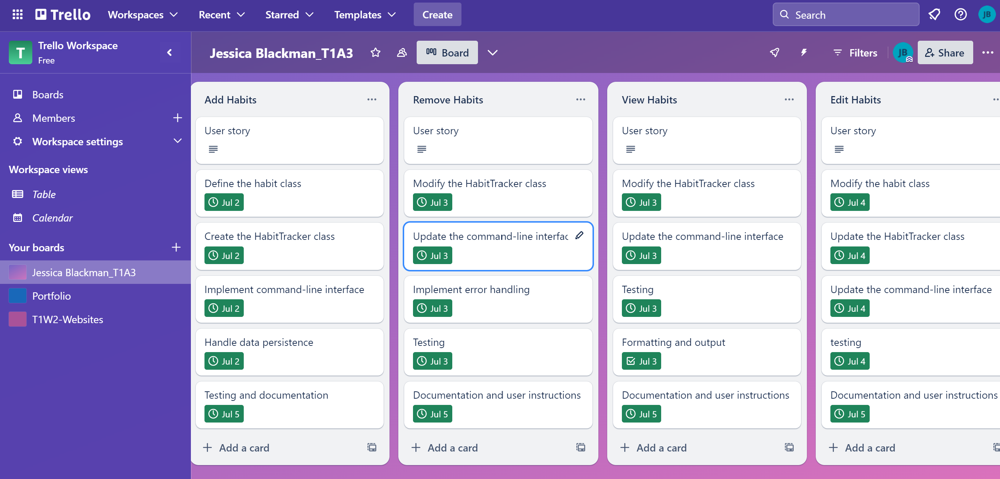

# Jessica_Blackman_T1A3

## Prerequisites
- Python3 + Venv

## Installation Steps
- `python3 -m venv venv`
- `source venv/bin/activate`
- `pip install -r requirements.txt`

## To deactivate venv
- `deactivate`

## Instructions on using the Habit Track terminal applicaiton
1. Change directory into terminal_app
- cd 2024-apr-std/Coder_Academy/jessicablackman_T1A3/terminal_app

2. If you haven't already, install:
- pip install pandas
- pip install tabulate
- pip install argparse

3. Use the main.py script to start the Habit Tracker
- python3 src/main.py <command> [option]

4. Add a new habit to the Habit Tracker
- python3 src/main.py add running --duration 25 --frequency 4

5. Remove an exisiting habit from the Habit Tracker
- python3 src/main.py remove <habit_name>
Example: python3 src/main.py remove running

6. View all habits in the Habit Tracker
- python3 src/main.py view (this will show all the existing habits you have entered)

7. Edit an existing habit in the Habit Tracker
- python3 src/main.py <habit_name> --new_name <new_name> --new_duration <new_duration> --new_frequency <new_frequency>
Example: python3 src/main.py running --new_duration 35

Additional notes:
JSON file: All habits are stored in a file called 'data/habits.json'.
Error handling: Anytime a common error is made such as missing the required argument.

The habit tracker allows you to efficiently manage your habits through the command line. It successfully manages your habits and provides feedback on the actions you have made towards your habit. 

## Trello
- The project management tool to assist with managing the progress and timeline of the terminal applicaiton.

## References
- Indently (2021). Creating a Habit Tracker (Backend) in Python Tutorial 2021. [online] YouTube. Available at: https://www.youtube.com/watch?v=snUk2Dx9Bz8&t=19s [Accessed 6 Jul. 2024].

‌- Aamod (2024). T1W8 Saturday: Testing, Virtual Environment, Python Files, Demo Terminal App. Coder Academy. Available at: https://ait.instructure.com/courses/5351/pages/conference-recordings-term-1-weeks-6-10.

‌- GeeksforGeeks. (2020). Serializing JSON data in Python. [online] Available at: https://www.geeksforgeeks.org/serializing-json-data-in-python/.

‌- W3schools (2018). Python Dictionaries. [online] W3schools.com. Available at: https://www.w3schools.com/python/python_dictionaries.asp.

‌- Python (2019). argparse — Parser for command-line options, arguments and sub-commands — Python 3.7.3 documentation. [online] Python.org. Available at: https://docs.python.org/3/library/argparse.html.

‌
